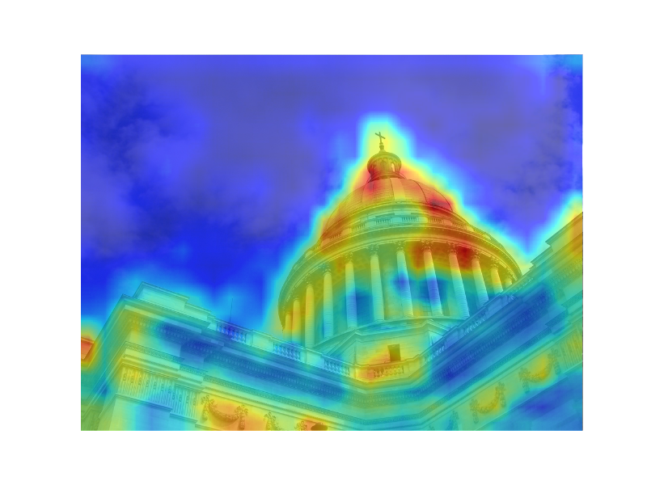

## mAP performance

The mAP performance on Oxford building dataset can be seen on [wiki](https://github.com/willard-yuan/cnn-cbir-benchmark/wiki)

#### Visualize heatmap

The `visualize_heatmap.py` is used to visualize heatmap.

